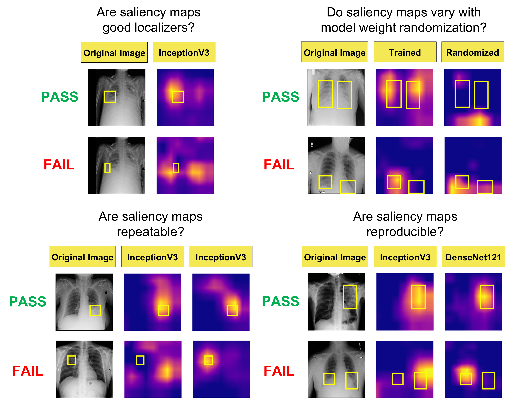

# Assessing Saliency Maps

In this study, we comprehensively evaluate popular saliency map methods for medical imaging classification models trained on the SIIM-ACR Pneumothorax Segmentation and RSNA Pneumonia Detection datasets in terms of 4 key criteria for trustworthiness: 
1. Utility 
2. Sensitivity to weight randomization 
3. Repeatability 
4. Reproducibility 

The combination of these trustworthiness criteria provide a blueprint for us to objectively assess a saliency map's localization capabilities (localization utility), sensitivity to trained model weights (versus randomized weights), and robustness with respect to models trained with the same architectures (repeatability) and different architectures (reproducibility). These criteria are important in order for a clinician to trust the saliency map output for its ability to localize the finding of interest.

